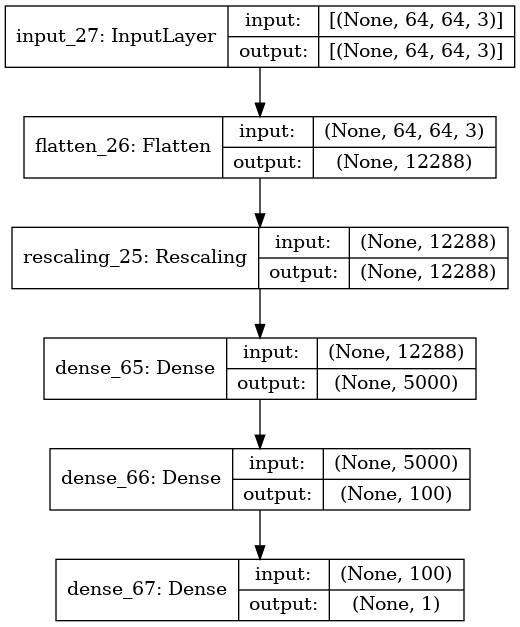

# keraskitten

Showcase of training a neural network with two dense hidden layers using keras.

## How to launch?

- Run `docker-compose up` and wait until ready (can take up to 10 minutes on first run)
- Open [http://localhost:8888/notebooks/keras_kitten.ipynb](http://localhost:8888/notebooks/keras_kitten.ipynb)
- Run notebook

# Neural Network

# Example output

## Credits
- [Jupyter in docker](https://github.com/andreivmaksimov/python_data_science)
- [deeplearning.ai cats vs non-cat dataset](https://www.floydhub.com/deeplearningai/datasets/cat-vs-noncat)
